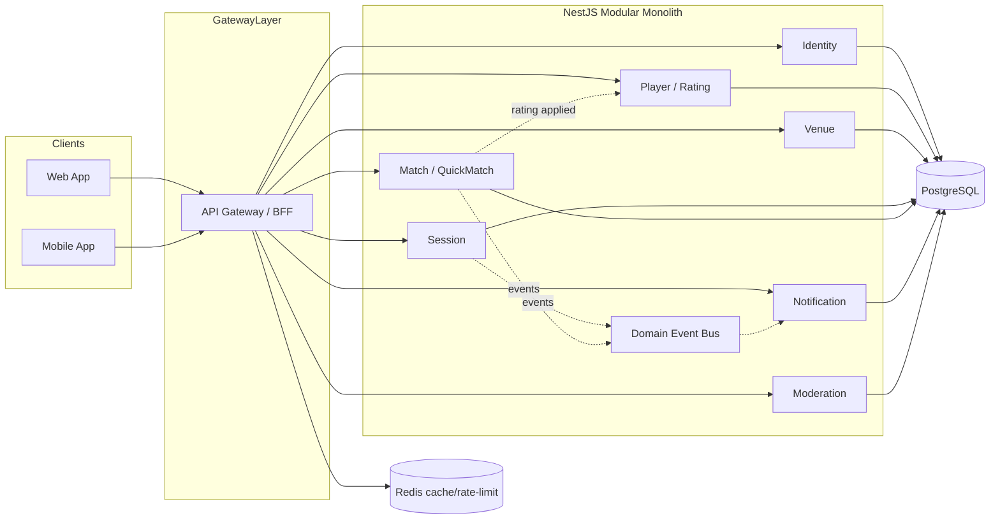

# Badminton Platform — Backend Architecture

> Modular Monolith, Domain-Driven, Secure-by-Design.
> Source of truth: `Tai_lieu_nghiep_vu_ung_dung_cau_long.docx.pdf` (Business Requirement v0.1).

## 0. Executive summary

MVP bắt buộc: đăng ký/đăng nhập bằng **số điện thoại + OTP** (không password), hồ sơ player, self-assessment → provisional rating, Session + chia chi phí, Match đôi 2v2 + xác nhận kết quả, Quick Rated Match bằng QR động 10 giây (mobile-only), Elo + rating history + leaderboard, notification in-app, dispute cơ bản, Admin web.

Hệ thống được xây dựng theo **Modular Monolith**: một ứng dụng NestJS, các module tách theo bounded context, domain logic nằm trong service layer thuần (không phụ thuộc framework), giao tiếp nội bộ qua DI + in-process domain events. Kiến trúc được thiết kế để có thể tách microservice bất kỳ lúc nào mà không đổi domain code (xem ADR-001).

## 1. Actors & roles

| Role | Quyền chính | Client |
|---|---|---|
| Guest | Xem giới thiệu, tìm session công khai, xem leaderboard | Web + Mobile |
| Player | Tham gia session, tạo match, check-in, xác nhận kết quả, xem Elo | Web + Mobile |
| Host | Quản lý slot, chi phí, sân, danh sách tham gia, bắt đầu session | Web + Mobile |
| Moderator | Xử lý dispute/report, khoá kết quả, void match rated, suspend Player | Web (bắt buộc) |
| Admin | Quản lý user, cấu hình Elo, danh mục sân, anti-fraud, báo cáo | Web (bắt buộc) |

Role được **provision qua vận hành** (seed/script), không đổi role qua public API (requirement §14.1).

## 2. Bounded contexts

| Context | Trách nhiệm | Ownership DB |
|---|---|---|
| Identity | OTP, JWT, session, device, trạng thái account | User, RefreshSession |
| Player | Hồ sơ thể thao, self-assessment, rating profile | PlayerProfile, RatingProfile, SelfAssessment, RatingTransaction |
| Venue | Danh mục sân/địa điểm | Venue |
| Session | Phiên chơi, tham gia, chia chi phí | Session, SessionParticipant |
| Match | Vòng đời match, đội, kết quả, xác nhận, dispute | Match, MatchPlayer, MatchResult, Dispute |
| QuickMatch | QR động, join, roster | (thuộc Match context) |
| Rating | Công thức Elo, leaderboard, recompute | (đọc Match + ghi Rating) |
| Notification | In-app inbox, dedupe | Notification |
| Moderation | Suspend, void match, audit, cấu hình Elo | AuditLog, EloConfig |

**Không** tạo service cho: Payment (ngoài MVP), Booking sân (ngoài MVP), Chat (ngoài MVP), Tournament (ngoài MVP).

## 3. Architecture diagram



## 4. Data ownership & multi-tenancy

- **Shared database**, một schema PostgreSQL, mỗi entity sở hữu bởi đúng một bounded context.
- Kiểu multi-tenancy đơn giản nhất phù hợp MVP: **Shared DB + tenant/owner scoping**. Hệ thống MVP hướng tới cộng đồng mở; "tenant" chính là phạm vi theo `region` và theo `club/group` (nếu có). Mọi query của player bị giới hạn bởi chính quyền sở hữu resource (IDOR prevention): user chỉ đọc/sửa dữ liệu mình là actor/participant hoặc admin.
- Xác minh quyền từ **JWT (trusted) + database check**, không tin `userId`/`role`/`tenantId` client gửi lên.
- Có test chống cross-user data leak (AC-12, AC-18).

## 5. Authentication / Authorization

- **OTP + phone**: request OTP (rate-limited 60s/phone), verify OTP (tối đa 5 lần, TTL 5 phút, dùng một lần). Dev-mode: OTP trả trong response để dễ demo (có cờ `SMS_MOCK`).
- **JWT access token** (15 phút) + **refresh token** (7 ngày, có rotation + revocation, lưu hash trong DB).
- **RBAC** roles `PLAYER`, `MODERATOR`, `ADMIN` — enforcement tại service sở hữu resource (không chỉ ở guard gateway).
- Player bị suspend → mọi authenticated request đọc `User.status` từ DB và từ chối (AC-20).

## 6. Core business rules (từ requirement)

### 6.1 Self-assessment → rating khởi tạo
- Rubric `schema_version = 2026.08.2`, đúng 10 câu, mỗi câu một enum.
- Backend tính tổng điểm 9 câu có điểm, S ∈ [0,28]; band + rating cố định (900–1600).
- `self_level` phải cùng band hoặc lệch ≤ 1 bậc, ngược lại từ chối.
- Chỉ backend tạo RatingProfile `PROVISIONAL`, `rated_matches=0`, deviation 350.
- Mỗi user chỉ tạo 1 lần → `ASSESSMENT_ALREADY_COMPLETED`.

### 6.2 Elo MVP
```
TeamRating = (r1 + r2) / 2
ExpectedA  = 1 / (1 + 10^((TB - TA) / 400))
BaseDelta  = K × (actual - expected)
finalDelta = half_up_away_from_zero(BaseDelta × format_weight × repeated_opponent_weight)
```
- K-factor theo `rated_matches` trước trận: 64 (0–5), 48 (6–10), 32 (11–30), 24 (>30).
- Format weight: BEST_OF_3 = 1.0, SINGLE_GAME_21 = 0.7; CUSTOM = unrated.
- `repeated_opponent_weight` trong cửa sổ 7 ngày: lần 1–2 → 1.0, 3 → 0.75, 4 → 0.50, ≥5 → 0.20 (dùng max của 4 cặp chéo).
- rating_deviation: 350 → giảm 20/trận → sàn 50.
- Leaderboard chính: `rated_matches >= 10 && unique_opponents >= 6 && state != UNDER_REVIEW`.
- Mọi thay đổi tạo `RatingTransaction` (audit + rollback). Không nhận `elo_delta`/`new_elo` từ client.

### 6.3 State machines
```
Session: DRAFT → OPEN → FULL → IN_PROGRESS → COMPLETED
         DRAFT/OPEN/FULL → CANCELLED

Match scheduled:
DRAFT → READY → CHECKED_IN → PLAYING → PENDING_CONFIRM → CONFIRMED → RATED
Match quick (no GPS): DRAFT → READY → PLAYING → PENDING_CONFIRM → CONFIRMED → RATED
Exceptions: PENDING_CONFIRM → DISPUTED → RESOLVED → RATED | VOIDED
            anti-fraud → PENDING_REVIEW (không cộng Elo)

RatingTransaction: PENDING → APPLIED | REVERSED
```

### 6.4 Xác nhận kết quả
- Một phía nhập tỷ số → ít nhất 1 đại diện phía đối thủ xác nhận; Quick Match: bắt buộc mobile.
- Đối thủ sửa tỷ số → trở lại PENDING_CONFIRM.
- Đủ 3/4 confirm + không dispute + anti-fraud PASS → auto-rate.
- Idempotent: 2 confirm đồng thời không tạo 2 RatingTransaction (unique constraint + transaction).

### 6.5 Quick Match QR
- Creator phải mobile (thiết bị có `deviceId`).
- QR token đổi mỗi 10 giây, backend ký HMAC, không tin timestamp client.
- Invite hết hạn 5 phút hoặc đủ 4 người. Join qua token hiện tại, ghi nhận match/user/device/window.
- Creator không thể thêm/xác nhận thay người chơi khác.

### 6.6 Notification
- Persist cùng transaction tạo ra nó; in-app inbox; `dedupe_key` unique per recipient (AC-18).

## 7. Event architecture (in-process MVP)

Dùng `@nestjs/event-emitter` in-process (phù hợp modular monolith MVP). Event contract đã định schema version, sẵn sàng đưa lên RabbitMQ khi tách service:

```
{
  eventId, eventType, eventVersion, occurredAt, tenantId, correlationId, data
}
```

Khi tách microservice: áp dụng **Transactional Outbox** (bảng `outbox_event`) + idempotent consumer. Nghiệp vụ có thể bị dual-write đã được đánh dấu TODO.

## 8. Security

- Helmet, CORS allowlist, body-size limit, request timeout, rate limiting (Throttler).
- ValidationPipe `whitelist + forbidNonWhitelisted + transform`.
- Không log secret/token/OTP (OTP dev chỉ trong response môi trường dev).
- Audit log append-only cho: suspend, dispute resolve, void match, admin config, inspection nhạy cảm.
- Anti-mass-assignment: mọi writable field map thủ công qua DTO.

## 9. Observability

- Structured JSON logging với `requestId`/`correlationId` (middleware sinh `X-Request-Id`).
- Metrics endpoints qua `/metrics` (Prometheus) — TODO.
- Distributed tracing — TODO (OpenTelemetry khi tách service).

## 10. ADR index

| ADR | Chủ đề |
|---|---|
| ADR-001 | Modular monolith thay vì microservices ở MVP |
| ADR-002 | Multi-tenancy: shared DB + owner-scoping |
| ADR-003 | OTP + JWT access/refresh |
| ADR-004 | In-process domain events, outbox-ready |
| ADR-005 | Elo engine là pure module, có test |
| ADR-006 | Database ownership theo bounded context |

## 11. Testing strategy

- Unit: Elo calculator, rubric scoring, OTP validate, cost split.
- Integration: API auth, sessions, matches, rating.
- Concurrency: 100 request confirm đồng thời → chỉ 1 RatingTransaction (AC-7).
- Security: IDOR, mass assignment, role bypass, tenant crossover, rate limit.
